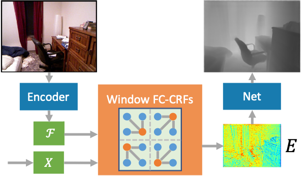
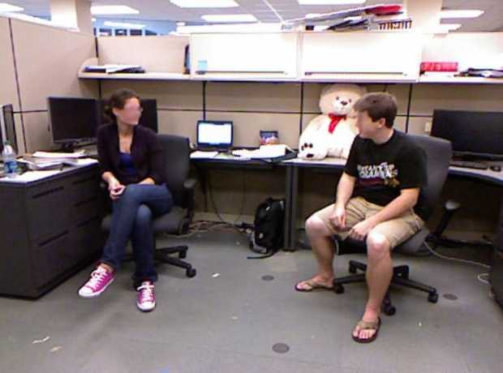
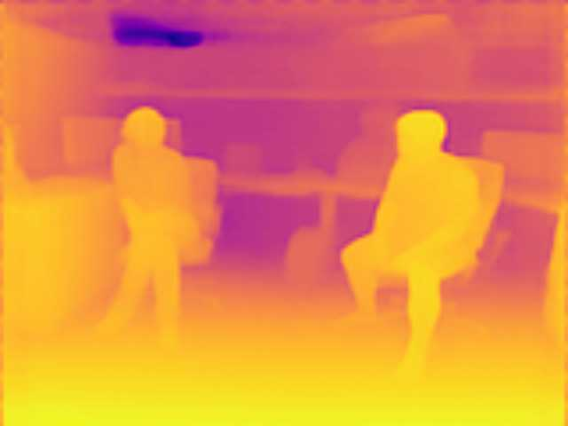
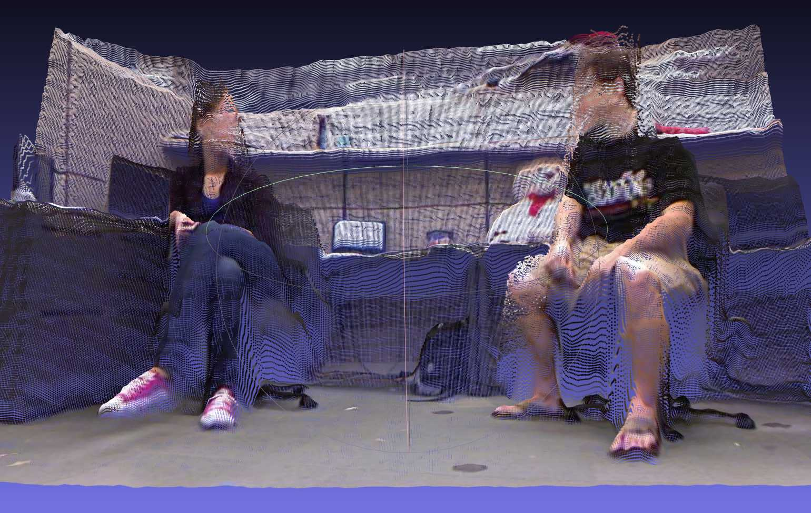

## NeW CRFs: Neural Window Fully-connected CRFs for Monocular Depth Estimation

This is the official PyTorch implementation code for NeWCRFs. For technical details, please refer to:

**NeW CRFs: Neural Window Fully-connected CRFs for Monocular Depth Estimation** <br />
Weihao Yuan, Xiaodong Gu, Zuozhuo Dai, Siyu Zhu, Ping Tan <br />
**CVPR 2022** <br />
**[[Project Page](https://weihaosky.github.io/newcrfs/)]** | 
**[[Paper](https://arxiv.org/abs/2203.01502)]** <br />


<p float="left">
  &emsp;&emsp; 
</p>
<!-- <p float="left">
  
  
  
</p> -->


## Bibtex
If you find this code useful in your research, please cite:

```
@inproceedings{yuan2022newcrfs,
  title={NeWCRFs: Neural Window Fully-connected CRFs for Monocular Depth Estimation},
  author={Yuan, Weihao and Gu, Xiaodong and Dai, Zuozhuo and Zhu, Siyu and Tan, Ping},
  booktitle={Proceedings of the IEEE Conference on Computer Vision and Pattern Recognition},
  pages={},
  year={2022}
}
```

## Contents
1. [Installation](#installation)
2. [Datasets](#datasets)
3. [Training](#training)
4. [Evaluation](#evaluation)
5. [Models](#models)
6. [Demo](#demo)

## Installation
```
conda create -n newcrfs python=3.8
conda activate newcrfs
conda install pytorch=1.10.0 torchvision cudatoolkit=11.1
pip install matplotlib, tqdm, tensorboardX, timm, mmcv
```


## Datasets
You can prepare the datasets KITTI and NYUv2 according to [here](https://github.com/cleinc/bts), and then modify the data path in the config files to your dataset locations.

Or you can download the NYUv2 data from [here](https://virutalbuy-public.oss-cn-hangzhou.aliyuncs.com/share/newcrfs/datasets/nyu/sync.zip) and download the KITTI data from [here](http://www.cvlibs.net/datasets/kitti/eval_depth.php?benchmark=depth_prediction).


## Training
First download the pretrained encoder backbone from [here](https://github.com/microsoft/Swin-Transformer), and then modify the pretrain path in the config files.

Training the NYUv2 model:
```
python newcrfs/train.py configs/arguments_train_nyu.txt
```

Training the KITTI model:
```
python newcrfs/train.py configs/arguments_train_kittieigen.txt
```


## Evaluation
Evaluate the NYUv2 model:
```
python newcrfs/eval.py configs/arguments_eval_nyu.txt
```

Evaluate the KITTI model:
```
python newcrfs/eval.py configs/arguments_eval_kittieigen.txt
```

## Models
| Model | Abs.Rel. | Sqr.Rel | RMSE | RMSElog | a1 | a2 | a3| SILog| 
| :--- | :---: | :---: | :---: |  :---: |  :---: |  :---: |  :---: |  :---: |
|[NYUv2](https://virutalbuy-public.oss-cn-hangzhou.aliyuncs.com/share/newcrfs/models/model_nyu.ckpt) | 0.0952 | 0.0443 | 0.3310 | 0.1185 | 0.923 | 0.992 | 0.998 | 9.1023 |
|[KITTI_Eigen](https://virutalbuy-public.oss-cn-hangzhou.aliyuncs.com/share/newcrfs/models/model_kittieigen.ckpt) | 0.0520 | 0.1482 | 2.0716 | 0.0780 | 0.975 | 0.997 | 0.999 | 6.9859 |


## Demo
Test images with the indoor model:
```
python newcrfs/test.py --data_path datasets/test_data --dataset nyu --filenames_file data_splits/test_list.txt --checkpoint_path model_nyu.ckpt --max_depth 10 --save_viz
```

Play with the live demo from a video or your webcam:
```
python newcrfs/demo.py --dataset nyu --checkpoint_path model_zoo/model_nyu.ckpt --max_depth 10 --video video.mp4
```


[Demo video1](https://www.youtube.com/watch?v=RrWQIpXoP2Y)

[Demo video2](https://www.youtube.com/watch?v=fD3sWH_54cg)

[Demo video3](https://www.youtube.com/watch?v=IztmOYZNirM)

## Acknowledgements
Thanks to Jin Han Lee for opening source of the excellent work [BTS](https://github.com/cleinc/bts).
Thanks to Microsoft Research Asia for opening source of the excellent work [Swin Transformer](https://github.com/microsoft/Swin-Transformer).